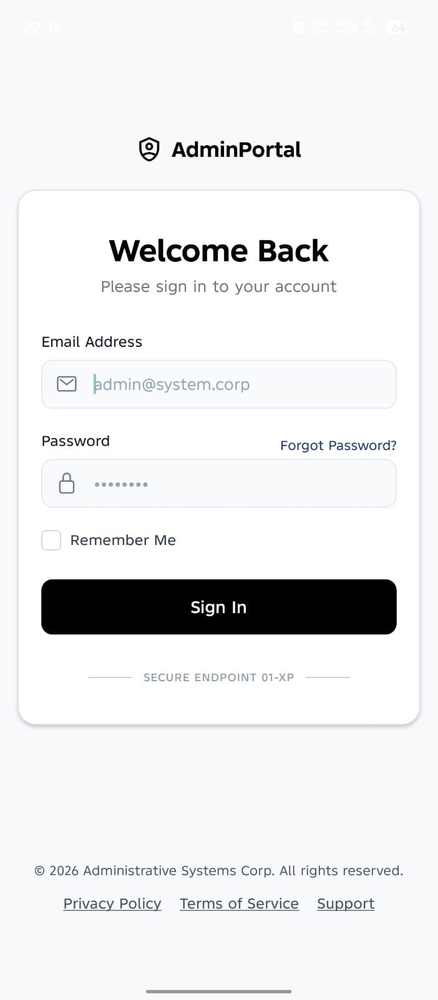
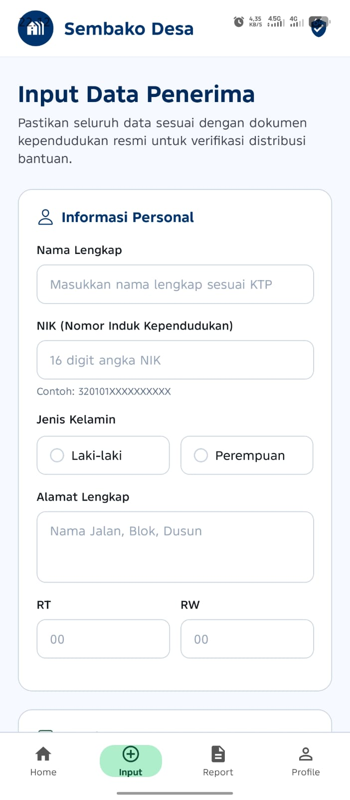
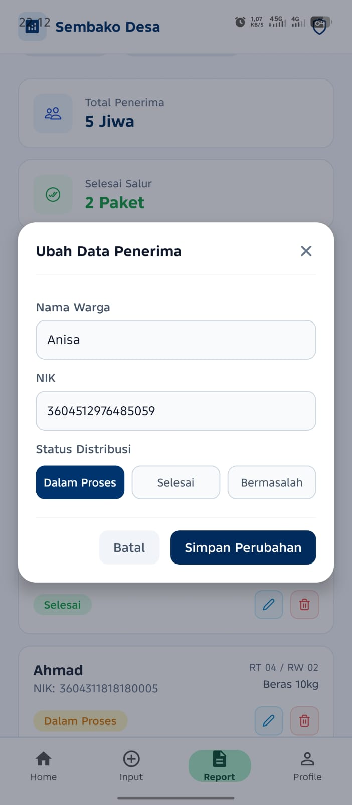
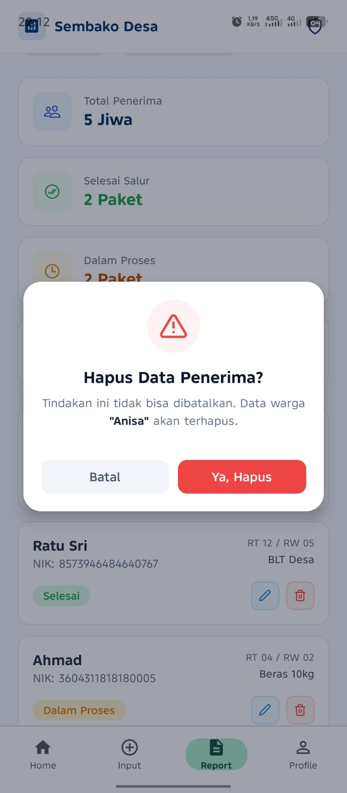
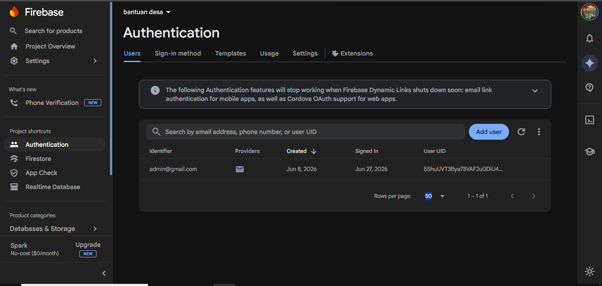

# 🏘️ Sistem Input Data Penerima Bantuan

Aplikasi mobile berbasis React Native Expo yang digunakan untuk mengelola dan menginput data penerima bantuan sosial di tingkat desa. Aplikasi ini memudahkan petugas desa dalam melakukan pendataan, pengelolaan, dan monitoring penerima bantuan secara digital menggunakan Firebase sebagai backend.

## 📱 Screenshot Aplikasi

Tampilan antarmuka:

| Login Admin | Dashboard |
|-----------|------------|
 |  
|  | 
|  | 
|  | 

Tampilan Database: 
| Screenshot | Screenshot |
|-----------|------------|
 |  
|

## Fitur Utama

**🔐 Autentikasi**
***Login Administrator***
***Logout Administrator***
***Session Login Firebase***

**Dashboard**
***Menampilkan informasi umum sistem seperti info dana dan info penerima nya***
***SAkses cepat ke menu utama yaitu input dan data laporan***
***Detail informasi***
***Komoditas sembako utama***

**Manajemen Penerima Bantuan**
***Tambah data penerima bantuan***
***Lihat daftar penerima bantuan***
***Edit data penerima bantuan***
***Hapus data penerima bantuan***
***Detail data penerima bantuan***

## Data Penerima Bantuan

**Data yang disimpan meliputi:**
- NIK
- Nama Lengkap
- Alamat
- RT
- RW
- Jenis Kelamin
- Jenis Bantuan
- Status Penerima

# Teknologi yang Digunakan
**Frontend**
- React Native
- Expo
- Expo Router
- TypeScript

**Backend**
- Firebase Authentication
- Cloud Firestore Database
- Penyimpanan Data
- Firebase Firestore (NoSQL)

## 🚀 Cara Menjalankan Aplikasi

### 1️⃣ Persiapan Awal
Pastikan sudah terinstall:
- **Node.js** (versi LTS)
- **NPM**
- **Expo CLI**
- **Aplikasi Expo Go** (Android / iOS)

# Struktur Folder
app/
│
├── (auth)
│   └── login.tsx
│
├── (tabs)
│   ├── index.tsx
│   ├── penerima.tsx
│   ├── profile.tsx
│   └── report.tsx
│
├── penerima
│   ├── tambah.tsx
│   └── [id].tsx
│
├── _layout.tsx
└── index.tsx

services/
│
├── firebase.ts
├── authService.ts
└── penerimaService.ts

## 🚀 Cara Menjalankan Proyek
**Clone repository ini**
```bash
git clone https://github.com/username/sistem-bantuan-desa.git
cd sistem-bantuan-desa
```
Install Dependency
```bash
npm install
```
Menjalankan Project
```bash
npx expo start
```
Menjalankan dengan Cache Bersih
```bash
npx expo start -c
```
Konfigurasi Firebase

# Buat file konfigurasi Firebase pada:

services/firebase.ts

Isi konfigurasi sesuai project Firebase yang digunakan.

Firestore Rules (Development)
rules_version = '2';

service cloud.firestore {
  match /databases/{database}/documents {
    match /{document=**} {
      allow read, write: if true;
    }
  }
}

# Catatan:
Rules di atas hanya digunakan selama tahap pengembangan. Untuk produksi, gunakan aturan keamanan yang lebih ketat.

## Tujuan Aplikasi

Aplikasi ini dibuat untuk membantu pemerintah desa dalam:

- Pendataan penerima bantuan sosial
- Monitoring distribusi bantuan
- Digitalisasi administrasi desa
- Mengurangi kesalahan pencatatan data manual
- Mempermudah pencarian data penerima bantuan

# Pengembang

Nama Proyek : Sistem Bantuan Desa

Platform : Android

Framework : React Native Expo

Database : Firebase Firestore

Authentication : Firebase Authentication
